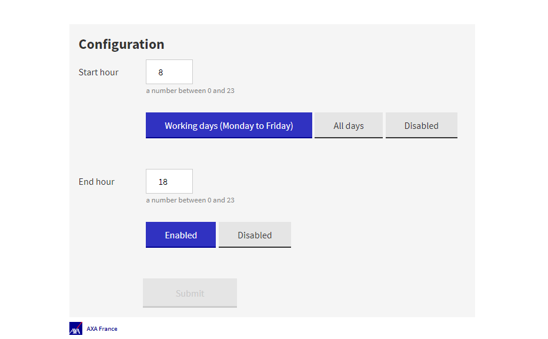

# DailyClean


- [About](#about)
- [Getting Started](#getting-started)
- [How Does It Work](#how-does-it-work)
- [Contribute](#contribute)

## About

Daily clean is all you to turn on or off automatically or manually all your pods your kubernetes namespace.
Save the planet with DailyClean.
Daily clean only use kubernetes native API.



## Getting Started

```
docker build --build-arg buildImage=factory/build/linux/java:11-ubi8-21-mandrel-alpha-quarkus --build-arg runtimeImage=factory/runtime/linux/java:11-ubi8-21-mandrel-alpha-quarkus --build-arg nodeImage=factory/build/linux/node:12-ubi8 -t quarkus/hello-quarkus .
docker run -i -d --rm -p 8080:8080 quarkus/hello-quarkus
# now you can open your browser to http://localhost:8080 
# you can change the price ratio by adding price_by_month query string: http://localhost:8080?price_by_month=100 the default price is 75
```

## How Does It Work

- Daily clean use native kubernetes API, it works with any kubernetes projects. 
DailyClean is a pod that have to be install in your namespace. 
It create cron job that start or stop your pods. 
- API is in native GraalVM so it is lightweight.
- User interface is in React/Javascript.

## Contribute

- [How to run the solution and to contribute](./CONTRIBUTING.md)
- [Please respect our code of conduct](./CODE_OF_CONDUCT.md)